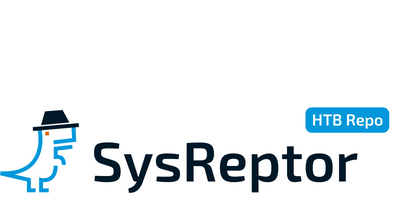

# Hack The Box Reporting using SysReptor
<h1 align="center">
    <br>
    <a href="https://docs.sysreptor.com/"></a>
</h1>

<h4 align="center">Easy and customisable pentest report creator based on simple web technologies.</h4>

<p align="center">
<a href="https://github.com/syslifters/sysreptor/">
    
</a>
<a href="https://github.com/syslifters/sysreptor/releases/latest">
    
</a>
<a href="https://github.com/syslifters/sysreptor/releases/latest">
    
</a>
<a href="https://github.com/syslifters/sysreptor/releases/latest">
    
</a>
<a href="https://www.linkedin.com/company/syslifters/">
    
</a>
<a href="https://twitter.com/intent/user?screen_name=sysreptor">
    
</a>
</p>

<p align="center">
  <a href="https://cloud.sysreptor.com/demo">Playground</a> •
  <a href="https://github.com/Syslifters/sysreptor/discussions/categories/ideas">Ideas</a> •
  <a href="https://github.com/Syslifters/sysreptor/discussions/categories/q-a">Questions</a> •
  <a href="https://docs.sysreptor.com/">Documentation</a> •
  <a href="https://docs.sysreptor.com/features-and-pricing/">Features and Pricing</a> •
  <a href="https://docs.sysreptor.com/setup/installation/">Installation</a> •
  <a href="https://cloud.sysreptor.com/order/">Buy SysReptor</a>
</p>

---

Hello 👋 we are the [Syslifters](https://www.syslifters.com/en/home), the brainos behind SysReptor. SysReptor is a fully customisable, offensive security reporting tool designed for pentesters, red teamers and other security-related people alike. You can create designs based on simple HTML and CSS, write your reports in user-friendly Markdown and convert them to PDF with just a single click - in the cloud or on-premise!

## Hack The Box Reporting
This is our dedicated [HTB](https://www.hackthebox.com/) reporting repository that showcases the Hack The Box sample report design created with SysReptor. You can use it for free to write your HTB Certified Penetration Testing Specialist (CPTS) or Certified Bug Bounty Hunter (CBBH) exam report. Our actual SysReptor repository can be found on Github here: [SysReptor](https://github.com/Syslifters/sysreptor). 

A rendered version of the report design can be seen below, the design itself is fully customizable ofc. Try it out and use SysReptor for free to write your Hack The Box CPTS or CBBH reports. Feedback is very welcome! ❤️

<h2 align="center">🚀 Sign up <a class="md-button" href="https://cloud.sysreptor.com/oscp/signup/">here</a></h2>
<br>

### Prefer self-hosting?

1. [Install](https://docs.sysreptor.com/setup/installation/) SysReptor 
2. Import all HTB Designs:

```shell linenums="1"
cd sysreptor/deploy
url="https://docs.sysreptor.com/assets/htb-designs.tar.gz"
curl -s "$url" | docker compose exec --no-TTY app python3 manage.py importdemodata --type=design
```

<h4>💡 Have a look at our documentation <a class="md-button" href="https://docs.sysreptor.com/">here</a></h4>
<br>

P.S. you are missing a specific template, have feedback or any other requests?  
Just let us know! Open an issue or mail us and we'll have a look and come back to you.

Happy Reporting! :)  
<b>Team Syslifters</b> 🦖  
<a href="https://syslifters.com">https://syslifters.com</a>
<br>

## Your Benefits
💲 Free  
📝 Write in markdown  
⚙️ Render your report to PDF  
🛡️ CPTS, CBBH
🚀 Fully customizable  
🎉  No need for Word  
👌  No local software troubleshooting


## Your Hack The Box Report Within Minutes


## Hack The Box Report Template*
<p float="left">
<a href="https://docs.sysreptor.com/assets/reports/HTB-CPTS-Report-Demo.pdf">

</a>
</p>

* The structure follows the official [HTB]([https://www.offsec.com/](https://www.hackthebox.com/)) reports (with kind permission by HackTheBox).

## Hack The Box Abbreviations

Exam acronym | Exam name                                         | Course details
-------------|---------------------------------------------------|-------------------
**CPTS**     | Certified Penetration Testing Specialist         | HTB Certified Penetration Testing Specialist (HTB CPTS) is a highly hands-on certification that assesses the candidates’ penetration testing skills. HTB Certified Penetration Testing Specialist certification holders will possess technical competency in the ethical hacking and penetration testing domains at an intermediate level. They will also be able to assess the risk at which an infrastructure is exposed and compose a commercial-grade as well as actionable report.
**CBBH**     | Certified Bug Bounty Hunter         | HTB Certified Bug Bounty Hunter (HTB CBBH) is a highly hands-on certification that assesses the candidates’ bug bounty hunting and web application pentesting skills. HTB Certified Bug Bounty Hunter certification holders will possess technical competency in the bug bounty hunting and web application penetration testing domains at an intermediate level. They will also be able to assess the risk at which a web application, service, or API is exposed and compose a commercial-grade as well as actionable report.
